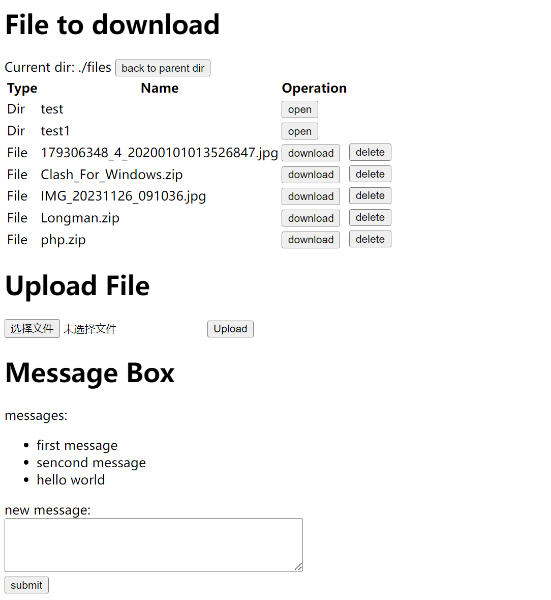

# File Transfer Application

This is a simple file transfer application built using Flask and Socket.IO. It allows users to manage and transfer files within a local network.

## Features

- **Directory Navigation:** Browse through directories and view files in the served directory.
- **Download, Upload, Delete Files**
- **Real-Time Data Refresh:** Utilizes Socket.IO for automatic data refresh, ensuring that changes made by one user are instantly reflected for all connected users.
- **Message Box:** Communicate with other users through a message box that supports multiple lines of text.



## Getting Started

### Prerequisites

- Python 3.x
- Flask
- Flask-SocketIO

### Installation

1. Clone the repository:

   ```bash
   git clone git@github.com:Joiy908/file_transfer_py.git
   cd file_transfer_py
   ```

2. Install dependencies:

    ```bash
    mkdir files
    pip install -r requirements.txt
    ```

3. Run the application:

    ```bash
    python app.py [-enable_del]
    ```

- By default, the delete feature is disabled. To enable it, run the application with the `-enable_del`.

The app will be available at `http://your_ipv4:8080`.

PS: If the err `err: fail to get ip address` show, change the `get_ipv4()` function in app.py to fit your environment.

## Quick Shell Script

Here is a quick shell script to parse command-line arguments, activate the virtual environment, change to the project directory, and run the Flask app with an optional flag:

```bash
# Parse command-line arguments
while [[ $# -gt 0 ]]; do
    key="$1"

    case $key in
        -del|--enable-delete)
        ENABLE_DEL="-enable_del"
        shift
        ;;
        *)
        # Unknown option
        echo "Unknown option: $key"
        exit 1
        ;;
    esac
done

# Activate the virtual environment
source /d/src/Py_projects/projects_2022/file_transfer/flaskVenv/Scripts/activate

# Change to the project directory and run the Flask app with optional flag
cd /d/src/Py_projects/projects_2022/file_transfer/
python app.py $ENABLE_DEL
```

## License

This project is licensed under the MIT License - see the [LICENSE](https://chat.openai.com/c/LICENSE) file for details.
